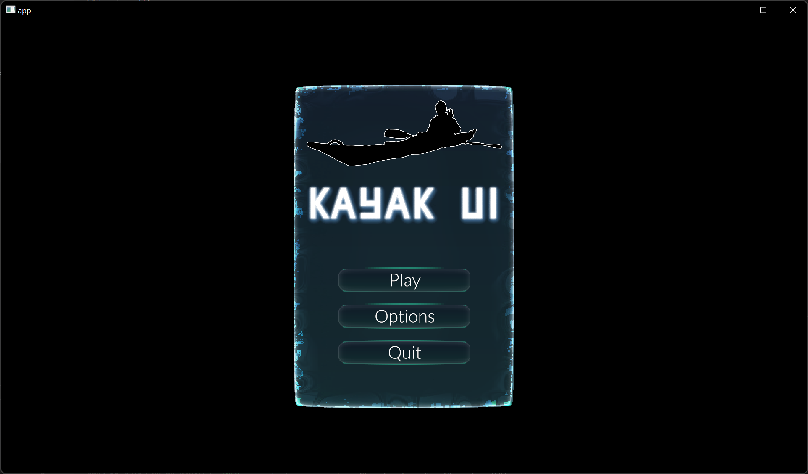

<p align="center">
    
</p>
<br/>

<h1>
    <p align="center">
    Kayak UI
    <p>
</h1>

## What is Kayak UI?
Kayak UI is a declarative UI that can be used to make user interfaces in Rust primarily targeting games. It's free and open-source!

Check out the book!
[Kayak UI Book](./book/src/SUMMARY.md)

## WARNING
Kayak UI is in the very early stages of development. Important features are missing and some documentation is missing. Kayak UI is designed to only work with Bevy.

## Features
- Easy to use declarative syntax using a custom proc macro
- Basic widget and global state management
- Input events (Mouse, Keyboard, Char)
- Fast and accurate layouts using morphorm: https://github.com/geom3trik/morphorm
- A few default widgets (check out Kayak's [built-in widgets](./src/widgets)!)
- Style system built to kind of mimic CSS styles.
- Image and Nine patch rendering.
- Vec widgets see vec example!

## Bevy Renderer Features
- Image and NinePatch renderer
- Fast MSDF Font renderer
- Quad renderer with rounded corners.
- Custom UI node to ensure UI renders on top of 3D and 2D entities.
- Fully integrated into bevy to capture input events, use bevy assets(images, etc).
- Dpi Scaling
- Batched Rendering

## Missing features
- More default widgets.
- More events

## Example Screenshot


## Usage
Use bevy `0.10`! Make sure the version of Kayak you are using uses the same version of bevy.

```rust
kayak_ui = "0.3"
bevy = "0.10"
```

|bevy|kayak_ui|
|---|---|
|`main`|`bevy-track`|
|0.10|0.3|
|0.9|0.2|
|0.9|0.1|

## Check out the book!
[Kayak UI Book](./book/src/SUMMARY.md)
