# Chapter 2 - Understanding flow
In Kayak widget structure and flow are important concepts. In this section we'll be discussion high level concepts on how Kayak UI works.

Kayak UI builds out UI using a tree structure. A widget can be defined as any object that lives in the UI tree. Typically a widget will have some sort of visual appearance, however that doesn't necessarily have to be the case. You might have widgets that manage state or just wrap other widgets.

## Core Concepts

### Widgets are entities
Kayak UI uses Bevy ECS. Each widget is considered an entity with a collection of data. Typically an widget and it's entity can contain whatever data desired, but some common components are:
- Mount - A component tag used to know that a widget was spawned and added to the tree.
- KStyle - Used to describe how a widget looks. Kayak uses this component to dictate UI rendering.
- KChildren - A collection of entities that are added to the tree in a deferred way. These entities are coming from higher up the hierarchy. 
- OnEvent - A mini/micro bevy system that lets you respond to UI input events.
- OnChange - A mini/micro system which allows changes to state based on value changes to state. 
- OnLayout - A mini/micro system which allows reaction to layout change events. I.E. the width, height, or position has changed.
- Focusable - Lets the event dispatcher know that this widget can be focused.
- WidgetName - All widgets require this component for internal purposes. This is essentially used to determine the "type" of a widget.

### Widgets and bundles?
It's advised to have bundles that correspond to a group of components on a widget. Example:
```rust
#[derive(Bundle)]
pub struct BackgroundBundle {
    pub background: Background,
    pub styles: KStyle,
    pub children: KChildren,
    pub on_event: OnEvent,
    pub widget_name: WidgetName,
}
```
Bundles are also required when using the RSX syntax:
```rust
rsx! {
    <BackgroundBundle
        styles: KStyle {
            background_color: Color::rgba(1.0, 1.0, 1.0, 1.0).into(),
            ..Default::default()
        }
    />
}
```
In the example above the RSX macro automatically adds missing fields in the bundle using rust default and the spread operator: `..Default::default()`. Because of this requirement users who want to use RSX need to also implement default on their bundles.

### Spawning Widgets
Widgets can be spawned using bevy's default spawning method. Example:
```rust
commands.spawn(MyWidgetBundle { .. });
```

However, it is advised that you use the `WidgetContext`'s `spawn_widget` function. This function caches entities at a specific spot in the tree. Take this tree for example:
```
widget1 - entity 2
    - widget2 entity 3
    - widget3 entity 4
```
When widget 1 renders it's children will have random entity id's if you use bevy's default spawning commands, but by using `spawn_widget` you can guarantee somewhat consistent entities. There are a couple of a caveats to this though. If a widget is despawned due to being removed from the tree it's entity id is no longer guaranteed. This means that entities that are removed from the tree will lose access to their context and state. It's important to remember that!

### Relationships

Widgets, by the nature of them being stored as a tree, contain certain relationships. The most common one is the *
parent-child* relationship. A widget may contain zero or more children.

<p align="center">
  
</p>

When a parent re-renders, it also causes its children to be re-rendered as well (more on this later).

Another implicit relationship is that of siblings. These aren't currently very useful in Kayak UI currently, but know that any time two widgets share a parent, they are considered siblings.

### Props

What good is a widget if it can't hold or process data? This is where the concept of *props* comes in (short for "
properties"). Props allow data to flow from parent to child.

<p align="center">
  
</p>

For example, a widget might have access to a game's player info. It could then take the current value of the player's
health points and pass that to a widget that is specifically configured to display health points. Which brings up
another important topic when talking about widgets: modularity.

### Modularity

Widgets are meant to be modular. It's rarely a good idea to have a widget with hundreds and hundreds of lines of code.
Kayak UI instead suggests breaking parts of your UI down into individual components. This could be as simple as breaking up logical parts of a single UI into multiple files in order to make things easier to read/maintain.

This modularity allows for widgets to be abstracted to cover more generic use-cases. Rather than having two different
widgets for a player's health points and a teammates, you could just create one reusable `Health` widget. Want to keep
the same functionality but modify the style for enemies? Wrap the `Health` widget in another widget that configures it
enough to fit your needs.

### State

To make widgets even more modular, provide greater functionality, and be reactive, widgets may contain their own state. While props can be used to pass data to widgets, state allows data to be retained. This is important because non-state data, such as props, are lost between renders. Without state, what goes in is all the widget has at its disposal.

This book has a [section](./chapter_4.md) dedicated to widget state so check that out for more on state!

### Lifecycle
The last core concept is that of *widget lifecycle*. Widgets have a lifecycle as entities which looks something like this:

1. Mount - This occurs when a widget is added to the tree for the first time. A component is added called `Mount` and is removed after the first render.
2. Update or Diff - During each update loop the widgets are diffed with previous values from the last update to see if they have changed. If a widget has changed it is re-rendered.
3. Render - Render occurs when a widget has changed and allows users to change behavior according to entity changes.
4. Layout - Occurs after the entire tree has been updated. Widget entities marked as "dirty" will have their rendering and layout recalculated.
5. Removal/Despawning - Entities that are removed from the tree are despawned additionally any children they had are also despawned and removed from the tree. It's important to avoid removing a widget from the tree if you need to preserve that widgets state.