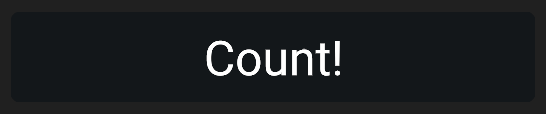
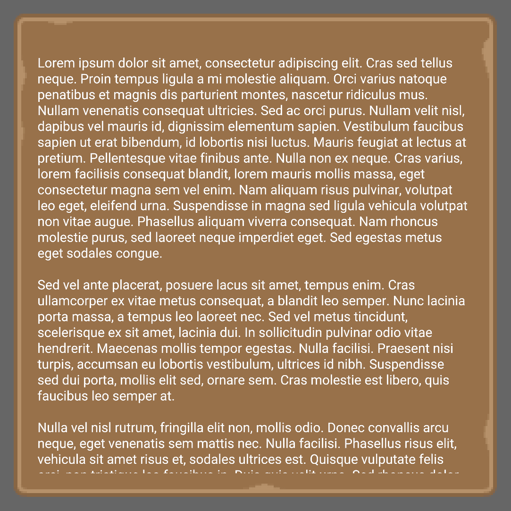
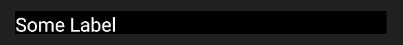
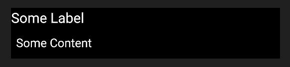
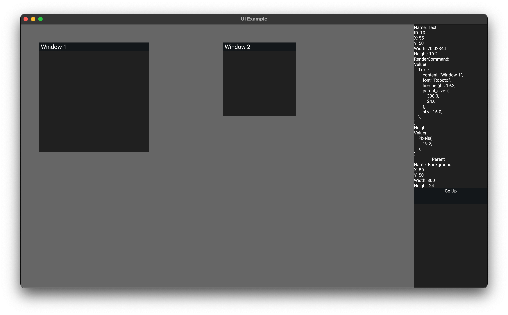
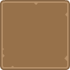
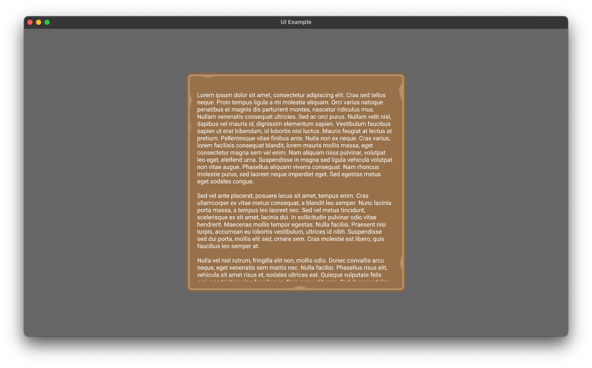
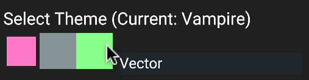
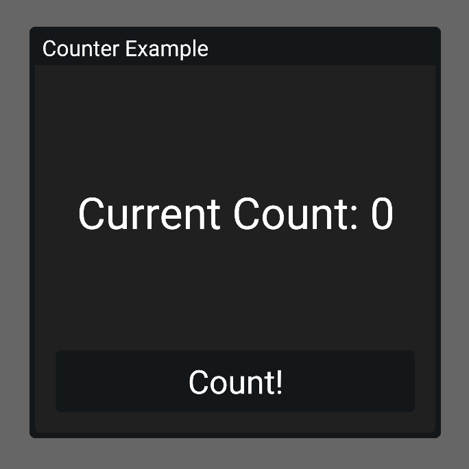

# Built-in Widgets

In Kayak UI we have a set of default widgets you can use that are completely optional.

## `App`

A top level widget that sizes your UI to the Bevy screen width/height (if the `bevy_renderer` feature is enabled). This allows it to update on window resize in order to match the width and height of the window.

### Common Props

| Common Prop | Accepted |
| :---------: | :------: |
| `children`  |    ✅     |
|  `styles`   |    ✅     |
| `on_event`  |    ✅     |
| `focusable` |    ✅     |

## `Background`

A widget that provides a simple, rectangular background by rendering a colored quad.

### Common Props

| Common Prop | Accepted |
| :---------: | :------: |
| `children`  |    ✅     |
|  `styles`   |    ✅     |
| `on_event`  |    ✅     |
| `focusable` |    ✅     |

## `Button`

A simple button widget.

### Common Props

| Common Prop | Accepted |
| :---------: | :------: |
| `children`  |    ✅     |
|  `styles`   |    ✅     |
| `on_event`  |    ✅     |
| `focusable` |    ✅     |

### Example

  

## `Clip`

A widget that clips its contents to fit the parent container or its designated `width` and `height` styling. Widgets rendered as children of a `Clip` will get "clipped" if they exceed the bounds of the clip.

### Common Props

| Common Prop | Accepted |
| :---------: | :------: |
| `children`  |    ✅     |
|  `styles`   |    ✅     |
| `on_event`  |    ✅     |
| `focusable` |    ❌     |

### Example

  

## `Element`

The most basic widget, equivalent to `div` from HTML.

### Common Props

| Common Prop | Accepted |
| :---------: | :------: |
| `children`  |    ✅     |
|  `styles`   |    ✅     |
| `on_event`  |    ✅     |
| `focusable` |    ✅     |

## `Fold`

A collapsable widget container that toggles its content between visible and hidden when clicked.

### Common Props

| Common Prop | Accepted |
| :---------: | :------: |
| `children`  |    ✅     |
|  `styles`   |    ✅     |
| `on_event`  |    ✅     |
| `focusable` |    ✅     |

### Example

#### Closed

  

#### Open

  

## `If`

A widget that will render its children depending on some condition.

### Common Props

| Common Prop | Accepted |
| :---------: | :------: |
| `children`  |    ✅     |
|  `styles`   |    ✅     |
| `on_event`  |    ✅     |
| `focusable` |    ✅     |

## `Image`

A widget that renders the provided image as a background.

### Common Props

| Common Prop | Accepted |
| :---------: | :------: |
| `children`  |    ✅     |
|  `styles`   |    ✅     |
| `on_event`  |    ✅     |
| `focusable` |    ✅     |

## `Inspector`

A special widget which allows you to "inspect" the tree by clicking on widgets.

### Common Props

| Common Prop | Accepted |
| :---------: | :------: |
| `children`  |    ❌     |
|  `styles`   |    ✅     |
| `on_event`  |    ❌     |
| `focusable` |    ❌     |

### Example

  

## `NinePatch`

A widget that renders a nine-patch image background.

A nine-patch is a special type of image that's broken into nine parts:

* **Edges** - Top, Bottom, Left, Right
* **Corners** - Top-Left, Top-Right, Bottom-Left, Bottom-Right
* **Center**

Using these parts of an image, we can construct a scalable background and border
all from a single image. This is done by:

* Stretching the edges (vertically for left/right and horizontally for top/bottom)
* Preserving the corners
* Scaling the center to fill the remaining space

### Common Props

| Common Prop | Accepted |
| :---------: | :------: |
| `children`  | ✅        |
| `styles`    | ✅        |
| `on_event`  | ✅        |
| `focusable` | ✅        |

### Example

|                         Image Source                         |                         Image Usage                          |
| :----------------------------------------------------------: | :----------------------------------------------------------: |
|  |  |

### ## `Text`

A widget that renders plain text.

### Common Props

| Common Prop | Accepted |
| :---------: | :------: |
| `children`  |    ❌     |
|  `styles`   |    ✅     |
| `on_event`  |    ✅     |
| `focusable` |    ✅     |

## `TextBox`

A widget that displays a text input field.

### Common Props

| Common Prop | Accepted |
| :---------: | :------: |
| `children`  |    ✅     |
|  `styles`   |    ✅     |
| `on_event`  |    ✅     |
| `focusable` |    ✅     |

### Example

  

## Tooltips

### `TooltipProvider`

A widget that provides a context for managing a tooltip. This widget creates a single tooltip that can be controlled by any descendant [`TooltipConsumer`](#tooltipconsumer) or by creating a consumer for `TooltipData`.

### Common Props

| Common Prop | Accepted |
| :---------: | :------: |
| `children`  |    ✅     |
|  `styles`   |    ✅     |
| `on_event`  |    ✅     |
| `focusable` |    ❌     |

### `TooltipConsumer`

A widget that consumes the `TooltipData` from a [`TooltipProvider`](#tooltipprovider), providing a convenient way to apply a tooltip over its children.

### Common Props

| Common Prop | Accepted |
| :---------: | :------: |
| `children`  |    ✅     |
|  `styles`   |    ✅     |
| `on_event`  |    ✅     |
| `focusable` |    ❌     |

#### Example

  

## `Window`

A widget that renders a draggable window-like container element.

### Common Props

| Common Prop | Accepted |
| :---------: | :------: |
| `children`  |    ✅     |
|  `styles`   |    ✅     |
| `on_event`  |    ✅     |
| `focusable` |    ✅     |

### Example

  

